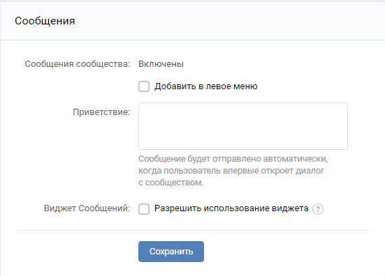
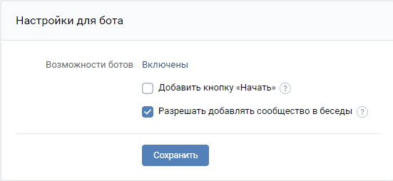

# VK bot for a test task for JustAI.
1. [Интеграция бота VK](#Интеграция-бота-VK)
    * [Условие задания](#Условие-задания)
    * [Требования к реализации](#Требования-к-реализации)
2. [Настройка доступа в VK](#Настройка-доступа-в-VK)
    * [Настройка сообщества](#Настройка-сообщества)
    * [Получение ключа доступа](#Получение-ключа-доступа)
    * [Подключение Callback API](#Подключение-Callback-API)
3. [Запуск](#Запуск)

## Интеграция бота VK

### Условие задания
В рамках задания нужно создать бота, который при его упоминании будет цитировать присланный ему текст. Пример 
взаимодействия с подобным ботом смотреть на картинке ниже.


### Требования к реализации

В качестве решения хотелось бы получить ссылку на git репозиторий в котором находятся исходники Spring Boot приложения 
выполняющего логику бота. Все параметры необходимые для корректного запуска и проверки должны задаваться в 
конфигурационных файлах (необходимо решить какие именно параметры). Все сущности с помощью которых осуществляется 
взаимодействие должны быть представлены в виде POJO. В README должен быть описан процесс запуска приложения и 
необходимые параметры конфигурации. **Нельзя использовать готовые библиотеки-реализации VkApi для Java.**

## Настройка доступа в VK

### Настройка сообщества

Для подключения чат-бота Вы можете использовать любое свое сообщество VK - группу, встречу или публичную страницу.

Укажите, что в сообществе будет работать бот. Для этого перейдите *Управление* > *Сообщения* > *Настройки для бота* и 
включите пункт *Возможности ботов*. Далее перейдите *Управление* > *Сообщения* и включите пункт *Сообщения сообщества*.



Чтобы бота смогли добавлять в беседы, необходимо включить эту возможность в настройках. Перейдите *Управление* > 
*Сообщения* > *Настройки для бота* и поставьте галочку в пункте *Разрешать добавлять сообщество в беседы*.



### Получение ключа доступа

Перейдите *Управление* > *Настройки* > *Работа с API* и нажмите *Создать ключ*


### Подключение Callback API

Для подключения Callback API перейдите *Управление* > *Настройки* > *Работа с API*, перейдите во вкладку Callback API и 
укажите адрес сервера, куда будут направляться все запросы.


Для этого потребуется использование внешних https адресов для локальной машины. Для этого можно 
использовать **ngrok**.

```shell
ngrok http 8080
```


Копируем http адрес и вставляем в поле *Адрес*, как и сделано на изображении выше.

## Запуск

Прежде чем запустить бота, нужно изменить ключ доступа (ACCESS_TOKEN), возвращаемую строку для проверки 
(CALLBACK_API_CONFIRMATION_TOKEN) и версию API (VERSION_API) в **application.properties**.

После этого запускаем **ngrok**, запускаем само приложение переходим в *Управление* > *Настройки* > *Работа с API* > 
*Callback API* и нажимаем подтвердить. Всё, теперь бот работает:

